# data-model.md — ERD tổng thể ERP Chuỗi Cung Ứng Phụ Tùng Ô Tô

> Tài liệu nền của Phase 0. Mọi phase sau (1–12) mở rộng từ đây, KHÔNG tạo bảng trùng chức năng.
> Nguồn: `docs/business-spec/01` đến `14`, `docs/ROADMAP.md`, `CLAUDE.md` mục 3-4.
> Ký hiệu tên bảng/field dùng English (PascalCase model, camelCase field) vì đây là nguồn để sinh `prisma/schema.prisma` trực tiếp. Mô tả nghiệp vụ dùng tiếng Việt.

---

## 1. Quy ước bắt buộc (theo CLAUDE.md mục 4)

| Quy ước | Chi tiết |
|---|---|
| Khóa chính | `id String @id @default(cuid())` cho MỌI bảng |
| Multi-tenant sẵn sàng | Mọi bảng nghiệp vụ chính có `companyId String` (FK → `Company`), hiện tại chỉ 1 company mặc định |
| Tiền tệ | Lưu `Int` (đơn vị nhỏ nhất — đồng), KHÔNG `Float`/`Decimal`. Mỗi bảng có field tiền phải có kèm `currency String` (mặc định `"VND"`) |
| Ngoại tệ & tỷ giá | Chỉ áp dụng ở các bảng xuyên biên giới: `PurchaseOrder`, `ImportShipment`, `SupplierInvoice`, `Payment` → có thêm `exchangeRate Float` (tỷ giá tại thời điểm ghi nhận). Chi tiết đầy đủ ở `docs/currency-handling.md` (chưa soạn — xem mục "Còn thiếu" trong TASKS.md) |
| Ngày giờ | `DateTime` (UTC), Prisma chuẩn |
| Soft delete / audit | Bảng nghiệp vụ chính có `createdAt`, `updatedAt`; xóa cứng KHÔNG dùng cho bảng đã phát sinh giao dịch — dùng `status` (vd. `INACTIVE`, `CANCELLED`) |
| Trạng thái | Field `status` dùng Prisma `enum`, không dùng string tự do |
| Quan hệ đa hình (approval, audit) | Dùng cặp `entityType String` + `entityId String` (không FK cứng — tránh phụ thuộc vòng giữa mọi bảng nghiệp vụ và bảng Workflow) |

---

## 2. Bản đồ module → nhóm bảng

| # | Module (theo ROADMAP phase) | Nhóm bảng chính |
|---|---|---|
| 1 | Foundation | Company, Branch, Department, Employee, Position, User, Role, Permission |
| 1 | Master Data lõi | Product, ProductCategory, UnitOfMeasure, VehicleModel, ProductVehicleCompatibility, Warehouse, StorageLocation |
| 2 | Procurement & Entrusted Import | PurchaseRequest(Line), PurchaseOrder(Line), Supplier, ImportShipment, ImportShipmentDocument, LandedCost(Allocation), GoodsReceipt(Line), ReceiptDiscrepancy |
| 3 | Inventory & Warehouse | SerialNumber, LotBatch, InventoryBalance, StockMovement, StockTransfer(Line), StockCount(Line) |
| 4 | Distribution & Consignment | Customer(Dealer), DealerProfile, ConsignmentAgreement, ConsignmentShipment(Line), ConsignmentBalance, ConsignmentSalesReport, ConsignmentReconciliation, StockRecall(Line) |
| 5 | Sales Order & Customer | Customer, PriceList(Item), Quotation(Line), SalesOrder(Line), StockReservation, SalesReturn(Line) |
| 6 | Logistics & Delivery | DeliveryRequest(Line), Vehicle, Driver, Carrier, Shipment(Line), ProofOfDelivery, DeliveryCost |
| 7 | Warranty/RMA/Field Service | WarrantyPolicy, WarrantyRegistration, WarrantyClaim, RmaRequest, CoreReturn, RepairOrder, FieldServiceRequest |
| 8 | Finance & Accounting | Account, JournalEntry(Line), CostCenter, SupplierInvoice, CustomerInvoice, Payment, BankAccount, FixedAsset, Budget |
| 9 | HRM & Payroll | Employee, EmploymentContract, Shift, AttendanceRecord, LeaveRequest, Payroll, CommissionRecord |
| 10 | Workflow/Approval | ApprovalMatrix, ApprovalRequest, ApprovalStep, AuditLog, Notification |

---

## 3. Foundation — Company / Organization / User / Role

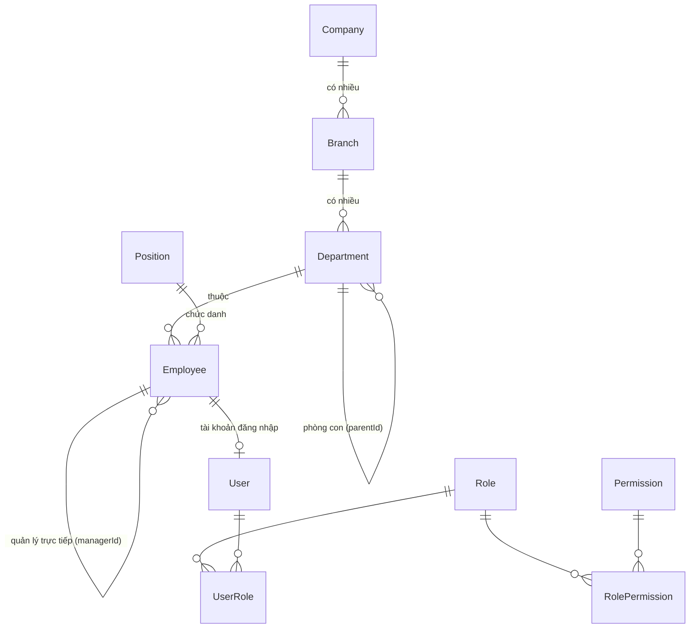

- **Company**: `code`, `name`, `taxCode`, `address`, `baseCurrency` (mặc định `VND`)
- **Branch**: `companyId`, `code`, `name`, `address`, `type` (`HEAD_OFFICE`/`BRANCH`/`WAREHOUSE_SITE`)
- **Department**: `companyId`, `branchId`, `code`, `name`, `parentId` (self-relation)
- **Position**: `companyId`, `code`, `name`
- **Employee**: `companyId`, `code`, `fullName`, `dob`, `phone`, `email`, `departmentId`, `positionId`, `managerId` (self-relation), `hireDate`, `employeeType` (`FULL_TIME`/`PART_TIME`/`CONTRACT`/`OUTSOURCE`), `status`
  - Được tham chiếu xuyên module: `salesRepId` (Sales), `technicianId` (Field Service), `driverId` (Logistics), `approvedById`/`requestedById` (Workflow)
- **User**: `companyId`, `employeeId` (nullable — user hệ thống không nhất thiết là nhân viên), `username`, `email`, `passwordHash`, `status` (`ACTIVE`/`LOCKED`/`DISABLED`), `lastLoginAt`
- **Role**: `companyId`, `code`, `name`
- **Permission**: `code`, `resource`, `action`
- **RolePermission**: `roleId`, `permissionId`
- **UserRole**: `userId`, `roleId`

---

## 4. Master Data — Product / UOM / Vehicle Compatibility / Price

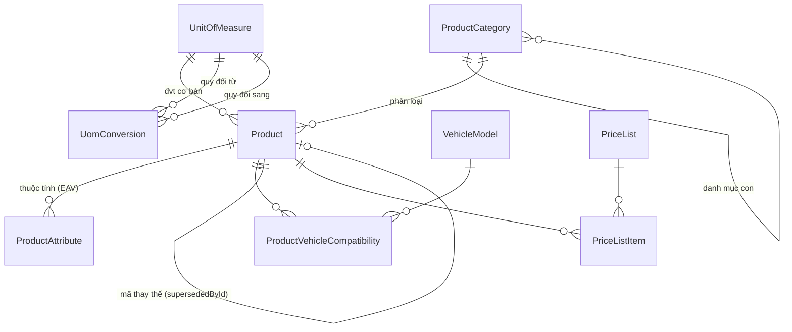

- **ProductCategory**: `companyId`, `code`, `name`, `parentId` (cây phân loại: Động cơ/Điện/Gầm...)
- **UnitOfMeasure**: `companyId`, `code`, `name` (Cái, Bộ, Thùng, Container, Kg)
- **UomConversion**: `fromUomId`, `toUomId`, `factor` (vd. 1 Thùng = 20 Cái)
- **Product**: `companyId`, `code` (SKU, unique), `name`, `tradeName`, `technicalName`, `categoryId`, `baseUomId`, `brand`, `originCountry`, `oemCode`, `manufacturerCode`, `partNumber`, `supersededById` (self-relation — mã mới thay mã cũ), `manageSerial Boolean`, `manageLot Boolean`, `manageExpiry Boolean`, `safetyStock Int`, `reorderPoint Int`, `moq Int`, `leadTimeDays Int`, `status`
- **ProductAttribute**: `productId`, `name`, `value` (EAV — điện áp/model xe/firmware cho ECU; kích thước/tải trọng cho lốp...)
- **VehicleModel**: `companyId`, `make`, `model`, `yearFrom`, `yearTo`, `engine`, `fuelType`
- **ProductVehicleCompatibility**: `productId`, `vehicleModelId` (many-to-many)
- **PriceList**: `companyId`, `code`, `name`, `type` (`PURCHASE`/`COST`/`SALE`/`DEALER`/`PROJECT`/`PROMOTION`), `currency`, `effectiveFrom`, `effectiveTo`
- **PriceListItem**: `priceListId`, `productId`, `unitPrice Int`, `currency`, `minQty`

---

## 5. Partner Master — Supplier / Customer / Dealer

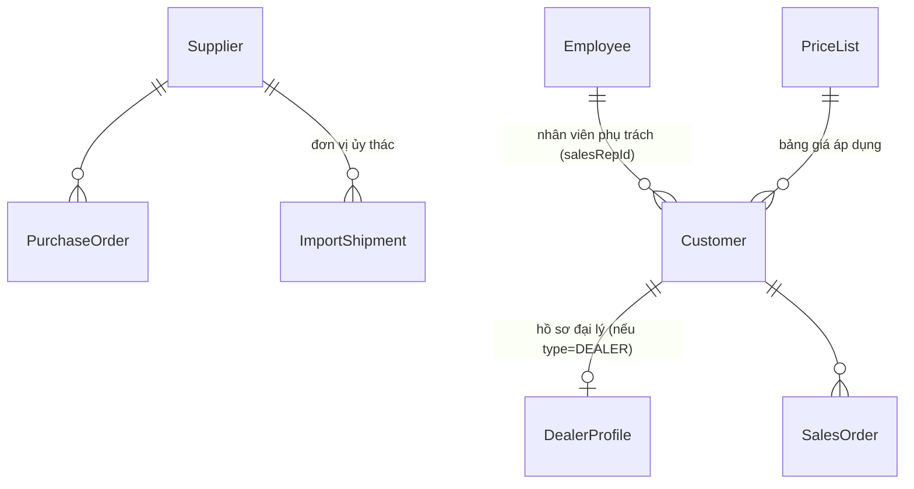

- **Supplier**: `companyId`, `code`, `name`, `type` (`FOREIGN_MANUFACTURER`/`SUPPLIER`/`ENTRUSTED_IMPORT_UNIT`/`CARRIER`/`SERVICE_PROVIDER`), `country`, `taxCode`, `contactName`, `phone`, `email`, `paymentTerm`, `currency`, `contractNumber`, `feePolicy` (dùng cho đơn vị ủy thác), `status`
- **Customer**: `companyId`, `code`, `name`, `type` (`DEALER`/`GARAGE`/`DISTRIBUTOR`/`ENTERPRISE`/`RETAIL`), `taxCode`, `address`, `region`, `contactName`, `phone`, `email`, `segment` (`VIP`/`A`/`B`/`C`/`INACTIVE`), `salesChannel`, `salesRepId`, `priceListId`, `creditLimit Int`, `creditTermDays Int`, `currentDebt Int`, `status`
- **DealerProfile** (1-1 mở rộng khi `Customer.type = DEALER`): `customerId` unique, `tier` (`PLATINUM`/`GOLD`/`SILVER`/`STANDARD`), `region`, `contractNumber`, `contractStart`, `contractEnd`, `committedRevenue Int`, `discountPolicy`

---

## 6. Warehouse & Location

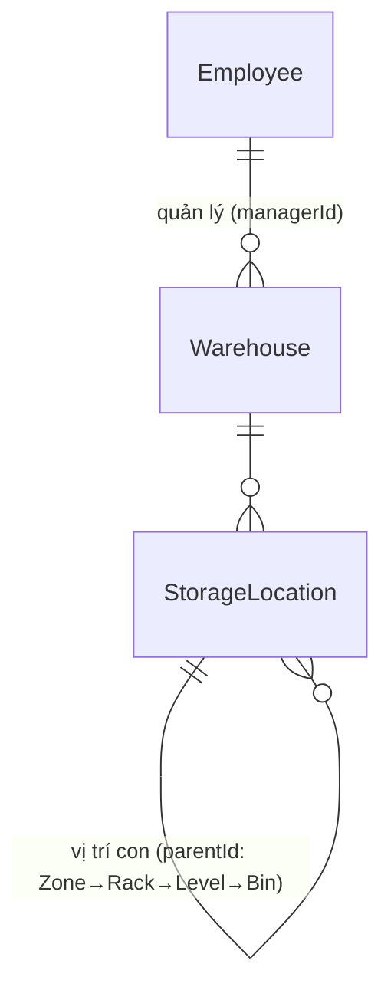

- **Warehouse**: `companyId`, `code`, `name`, `type` (`CENTRAL`/`BRANCH`/`CONSIGNMENT`/`WARRANTY`/`DEFECTIVE`/`QC`/`IN_TRANSIT`/`TECHNICIAN`/`DEMO`), `address`, `managerId`, `status`
- **StorageLocation**: `warehouseId`, `parentId` (self-relation, biểu diễn cây Zone → Rack → Level → Bin), `code`, `type` (`ZONE`/`RACK`/`LEVEL`/`BIN`), `capacity Int`

---

## 7. Procurement & Entrusted Import

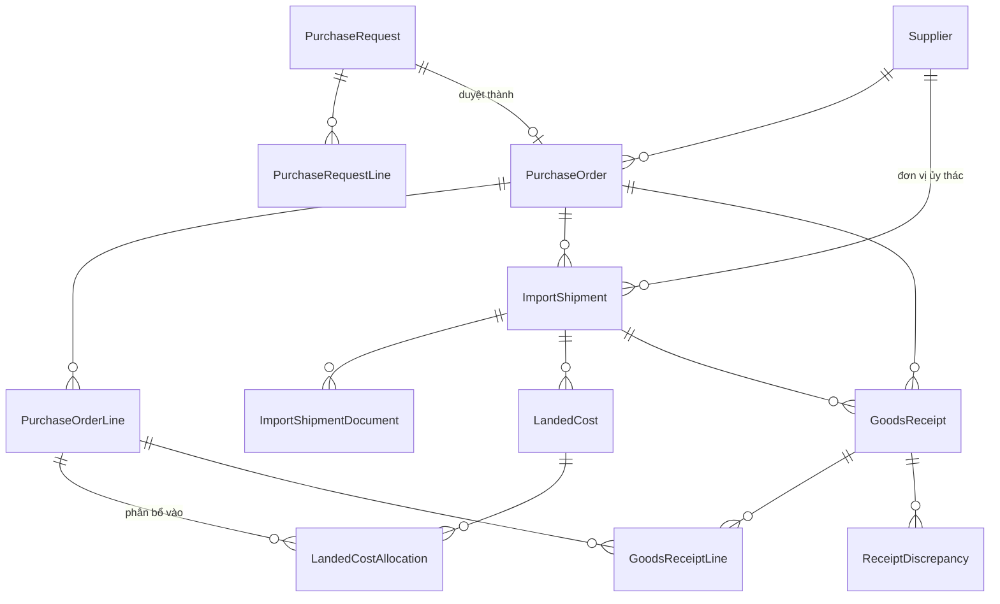

- **PurchaseRequest**: `companyId`, `code`, `requestedById`, `departmentId`, `warehouseId`, `reason`, `priority`, `status` (`DRAFT`/`PENDING_APPROVAL`/`APPROVED`/`REJECTED`/`CONVERTED`)
- **PurchaseRequestLine**: `prId`, `productId`, `uomId`, `qty`, `estimatedPrice Int`, `currency`, `neededDate`
- **PurchaseOrder**: `companyId`, `code`, `prId` (nullable), `supplierId`, `entrustedImportUnitId` (nullable, FK → Supplier), `currency`, `exchangeRate`, `paymentTerm`, `incoterm`, `expectedDeliveryDate`, `status` (`DRAFT`/`PENDING_APPROVAL`/`APPROVED`/`SENT_SUPPLIER`/`CONFIRMED`/`SHIPPING`/`PARTIALLY_RECEIVED`/`CLOSED`/`CANCELLED`)
- **PurchaseOrderLine**: `poId`, `productId`, `qty`, `unitPrice Int`, `discount Int`, `tax Int`, `totalAmount Int`, `qtyReceived`, `qtyRemaining`
- **ImportShipment**: `companyId`, `code`, `poId`, `supplierId`, `entrustedImportUnitId`, `carrierId` (nullable, FK → Carrier), `eta`, `etd`, `actualArrivalDate`, `status` (`WAITING_SUPPLIER`/`READY_TO_SHIP`/`SHIPPING`/`ARRIVED_PORT`/`CUSTOMS_PROCESSING`/`WAREHOUSE_RECEIVING`/`COMPLETED`)
- **ImportShipmentDocument**: `shipmentId`, `type` (`COMMERCIAL_INVOICE`/`PACKING_LIST`/`BILL_OF_LADING`/`CERTIFICATE_OF_ORIGIN`/`CUSTOMS_DECLARATION`/`HANDOVER_REPORT`), `fileUrl`, `receivedAt`
- **LandedCost**: `companyId`, `shipmentId`, `costType` (`PURCHASE_PRICE`/`ENTRUSTED_FEE`/`INTL_FREIGHT`/`DOMESTIC_FREIGHT`/`INSURANCE`/`IMPORT_TAX`/`HANDLING`/`OTHER`), `amount Int`, `currency`, `allocationMethod` (`BY_VALUE`/`BY_QTY`/`BY_WEIGHT`/`BY_VOLUME`)
- **LandedCostAllocation**: `landedCostId`, `poLineId`, `allocatedAmount Int` (kết quả: giá vốn thực tế/SKU)
- **GoodsReceipt**: `companyId`, `code`, `warehouseId`, `poId`, `shipmentId` (nullable), `receivedById`, `receivedAt`, `status`
- **GoodsReceiptLine**: `receiptId`, `poLineId`, `productId`, `serialId` (nullable), `lotId` (nullable), `qtyOrdered`, `qtyReceived`, `qcResult` (`PASS`/`REJECT`/`CONDITIONAL_PASS`)
- **ReceiptDiscrepancy**: `receiptId`, `productId`, `type` (`SHORT`/`OVER`/`WRONG_ITEM`/`DAMAGED`), `qty`, `note`

---

## 8. Inventory & Warehouse Operations

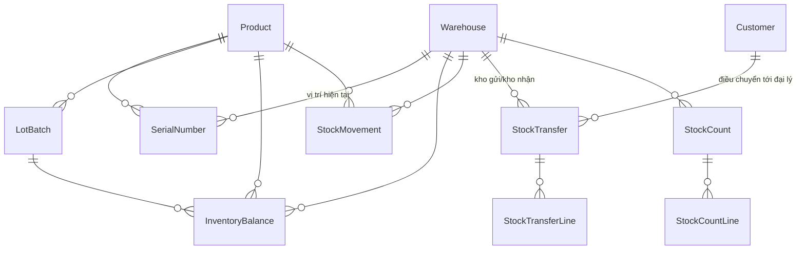

- **SerialNumber**: `companyId`, `productId`, `serialNo` (unique), `warehouseId` (nullable — null khi đã bán/ở khách hàng), `locationId` (nullable), `lotId` (nullable), `status` (`IN_STOCK`/`RESERVED`/`SOLD`/`CONSIGNED`/`IN_WARRANTY`/`DEFECTIVE`/`RETURNED`), `currentOwnerCustomerId` (nullable)
- **LotBatch**: `companyId`, `productId`, `lotNo`, `manufactureDate`, `expiryDate`, `manufacturerName`
- **InventoryBalance**: `companyId`, `warehouseId`, `productId`, `lotId` (nullable) — unique theo (`warehouseId`,`productId`,`lotId`); `onHandQty`, `reservedQty`, `availableQty` (= onHand − reserved), `inTransitQty`, `consignmentQty`, `warrantyQty`. **Bất biến bắt buộc**: `onHandQty >= 0` (không âm kho)
- **StockMovement** (sổ cái tồn kho — nguồn sự thật, `InventoryBalance` là cache tổng hợp): `companyId`, `warehouseId`, `productId`, `serialId` (nullable), `lotId` (nullable), `type` (`RECEIPT`/`ISSUE`/`TRANSFER_IN`/`TRANSFER_OUT`/`ADJUSTMENT`/`CONSIGNMENT_OUT`/`CONSIGNMENT_RETURN`/`WARRANTY_OUT`/`WARRANTY_IN`), `qty` (dương/âm), `refType` (vd. `"SalesOrder"`), `refId`, `movementDate`
- **StockTransfer**: `companyId`, `code`, `fromWarehouseId`, `toWarehouseId` (nullable), `toCustomerId` (nullable — điều chuyển tới đại lý), `status` (`PENDING_APPROVAL`/`APPROVED`/`PICKING`/`SHIPPING`/`RECEIVED`/`COMPLETED`), `requestedAt`, `shippedAt`, `receivedAt`
- **StockTransferLine**: `transferId`, `productId`, `serialId` (nullable), `lotId` (nullable), `qty`, `qtyReceived`
- **StockCount**: `companyId`, `warehouseId`, `code`, `status` (`DRAFT`/`COUNTING`/`SUBMITTED`/`APPROVED`/`CLOSED`), `countedAt`
- **StockCountLine**: `stockCountId`, `productId`, `systemQty`, `actualQty`, `varianceQty`

---

## 9. Distribution & Consignment (Dealer)

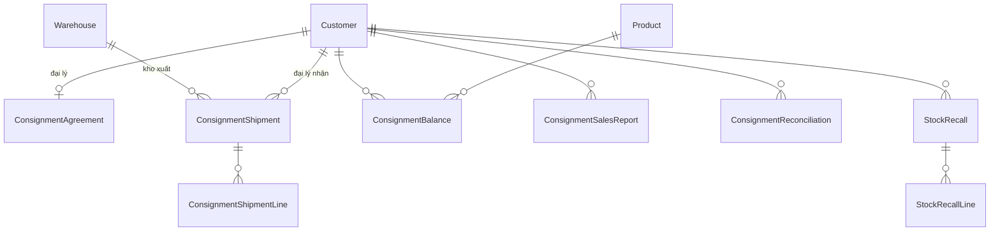

- **ConsignmentAgreement**: `companyId`, `dealerId` (FK → Customer), `contractNo`, `effectiveFrom`, `effectiveTo`, `reconciliationCycle` (`DAILY`/`WEEKLY`/`MONTHLY`), `maxStockValue Int` (hạn mức tồn ký gửi)
- **ConsignmentShipment**: `companyId`, `code`, `dealerId`, `fromWarehouseId`, `status` (`REQUESTED`/`APPROVED`/`PICKING`/`DELIVERED`/`CONFIRMED`), `shippedAt`, `receivedAt`
- **ConsignmentShipmentLine**: `shipmentId`, `productId`, `serialId` (nullable), `lotId` (nullable), `qty`, `unitCost Int`
- **ConsignmentBalance**: `companyId`, `dealerId`, `productId`, `serialId` (nullable) — unique theo (`dealerId`,`productId`,`serialId`); `qtyShipped`, `qtySold`, `qtyReturned`, `qtyOnHand`
- **ConsignmentSalesReport**: `companyId`, `dealerId`, `productId`, `serialId` (nullable), `qtySold`, `endCustomerName`, `soldAt`, `unitPrice Int`, `currency`, `reportedAt`, `source` (`PORTAL`/`MOBILE`/`EXCEL`/`API`)
- **ConsignmentReconciliation**: `companyId`, `dealerId`, `periodFrom`, `periodTo`, `systemQty`, `dealerReportedQty`, `varianceQty`, `status` (`OPEN`/`RESOLVED`/`DISPUTED`)
- **StockRecall**: `companyId`, `dealerId`, `code`, `reason`, `status` (`REQUESTED`/`APPROVED`/`PICKED_UP`/`RECEIVED`/`CLOSED`), `requestedAt`, `completedAt`
- **StockRecallLine**: `recallId`, `productId`, `serialId` (nullable), `qty`

---

## 10. Sales Order & Customer

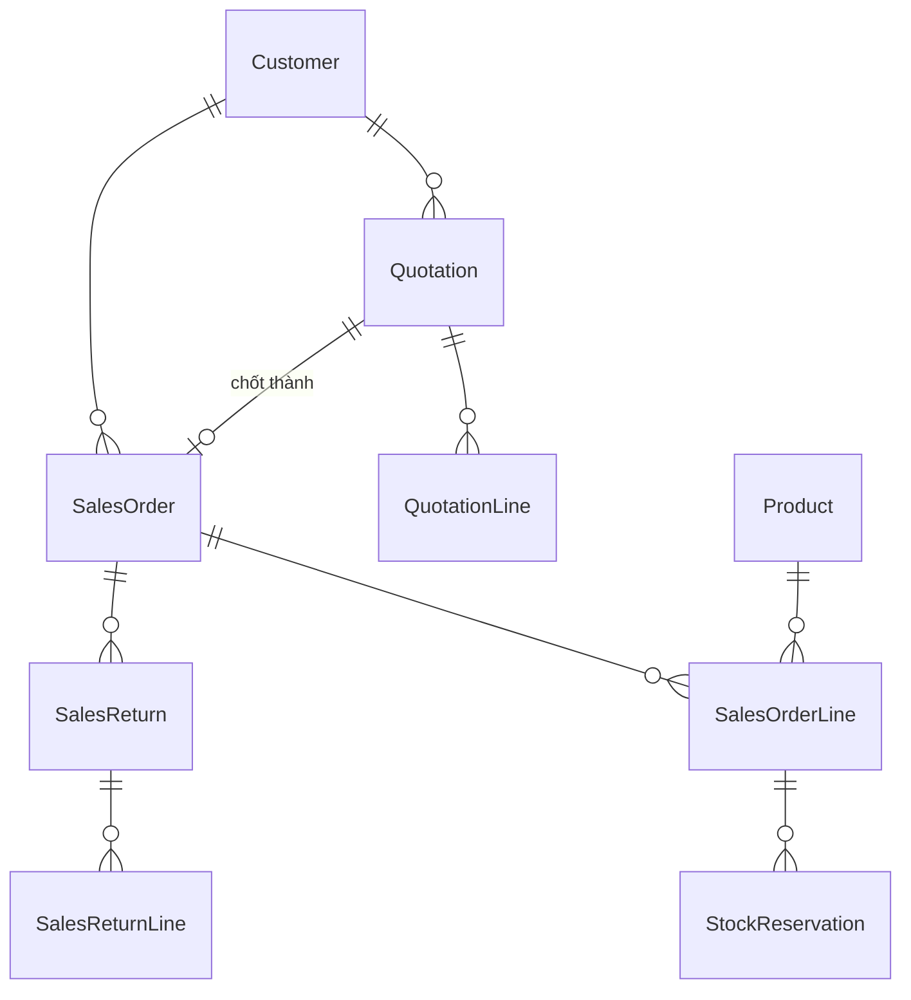

- **Quotation**: `companyId`, `code`, `customerId`, `salesRepId`, `validUntil`, `status` (`DRAFT`/`SENT`/`ACCEPTED`/`EXPIRED`/`REJECTED`)
- **QuotationLine**: `quotationId`, `productId`, `qty`, `unitPrice Int`, `discount Int`, `tax Int`, `totalAmount Int`
- **SalesOrder**: `companyId`, `code`, `quotationId` (nullable), `customerId`, `salesRepId`, `salesChannel` (`ONLINE`/`OFFLINE` — theo ROADMAP mục 4), `deliveryAddress`, `paymentTerm`, `confirmedAt`, `expectedDeliveryDate`, `status` (`DRAFT`/`PENDING_APPROVAL`/`CONFIRMED`/`ALLOCATED`/`PICKING`/`DELIVERED`/`INVOICED`/`PAID`/`CLOSED`/`CANCELLED`)
- **SalesOrderLine**: `soId`, `productId`, `qty`, `unitPrice Int`, `discount Int`, `tax Int`, `totalAmount Int`, `qtyDelivered`, `qtyReserved`
- **StockReservation**: `soLineId`, `warehouseId`, `productId`, `serialId` (nullable), `qty`, `reservedAt`, `expiresAt`
- **SalesReturn**: `companyId`, `code`, `soId`, `customerId`, `status` (`REQUESTED`/`APPROVED`/`RECEIVED`/`QC_DONE`/`REFUNDED`/`REJECTED`), `requestedAt`
- **SalesReturnLine**: `returnId`, `productId`, `serialId` (nullable), `qty`, `reason`

---

## 11. Logistics & Delivery

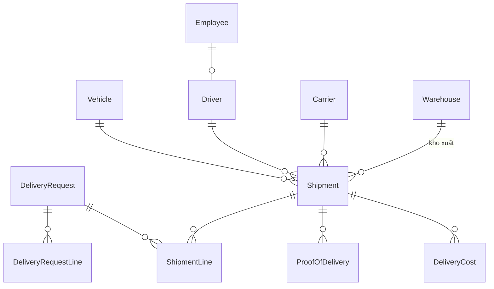

- **DeliveryRequest**: `companyId`, `code`, `sourceType` (`SALES_ORDER`/`CONSIGNMENT_SHIPMENT`/`WARRANTY_REPLACEMENT`/`STOCK_TRANSFER`), `sourceId`, `customerId` (nullable), `deliveryAddress`, `requestedAt`, `priority`, `status` (`DRAFT`/`PLANNED`/`PICKING`/`PACKED`/`ON_DELIVERY`/`DELIVERED`/`CONFIRMED`/`FAILED`/`CLOSED`)
- **DeliveryRequestLine**: `requestId`, `productId`, `serialId` (nullable), `lotId` (nullable), `qty`
- **Vehicle**: `companyId`, `plateNumber`, `type`, `capacity`, `status` (`AVAILABLE`/`ON_DELIVERY`/`MAINTENANCE`/`INACTIVE`)
- **Driver**: `companyId`, `employeeId` (unique), `licenseNo`, `licenseType`, `licenseExpiry`
- **Carrier**: `companyId`, `code`, `name`, `contractNo`, `serviceArea`
- **Shipment**: `companyId`, `code`, `warehouseId`, `vehicleId` (nullable), `driverId` (nullable), `carrierId` (nullable — thuê ngoài), `shippedAt`, `status` (theo `DeliveryRequest.status`)
- **ShipmentLine**: `shipmentId`, `deliveryRequestId`, `productId`, `qty`
- **ProofOfDelivery**: `shipmentId`, `receivedByName`, `receivedAt`, `signatureUrl`, `photoUrl`, `note`
- **DeliveryCost**: `shipmentId`, `type` (`FUEL`/`TOLL`/`THIRD_PARTY_CARRIER`/`LOADING`/`OTHER`), `amount Int`, `currency`

---

## 12. Warranty, RMA & Field Service

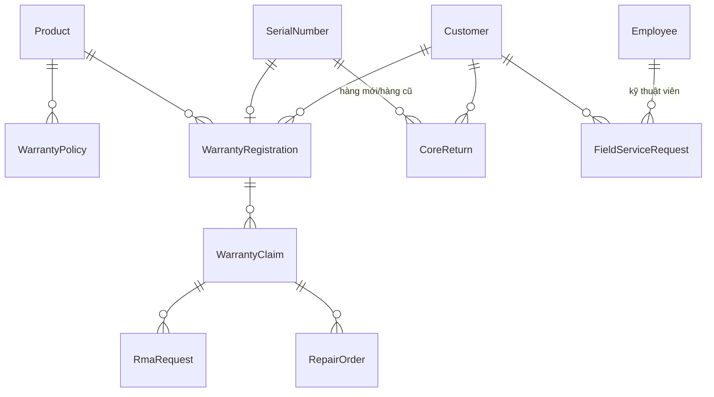

- **WarrantyPolicy**: `companyId`, `productId` (nullable), `categoryId` (nullable), `durationMonths`, `conditions`
- **WarrantyRegistration**: `companyId`, `productId`, `serialId` (nullable), `customerId`, `soId` (nullable, FK → SalesOrder), `vehicleModelId` (nullable), `soldAt`, `warrantyStart`, `warrantyEnd`
- **WarrantyClaim**: `companyId`, `code`, `registrationId`, `customerId`, `description`, `attachmentUrls`, `status` (`OPEN`/`INSPECTING`/`APPROVED`/`REJECTED`/`REPAIRING`/`REPLACED`/`CLOSED`)
- **RmaRequest**: `companyId`, `code`, `claimId` (nullable), `salesReturnId` (nullable), `status` (`REQUESTED`/`APPROVED`/`RECEIVED`/`QC_DONE`/`REPAIRED`/`REPLACED`/`REJECTED`)
- **CoreReturn**: `companyId`, `newSerialId` (FK → SerialNumber), `oldSerialId` (nullable, FK → SerialNumber), `customerId`, `deliveredAt`, `dueReturnAt`, `returnedAt`, `status` (`PENDING`/`RETURNED`/`OVERDUE`/`LOST`) — áp dụng ECU/Turbo/Hộp số/Máy phát điện
- **RepairOrder**: `companyId`, `claimId`, `technicianId` (FK → Employee), `laborCost Int`, `status` (`RECEIVED`/`DIAGNOSING`/`REPAIRING`/`TESTING`/`COMPLETED`/`RETURNED`)
- **FieldServiceRequest**: `companyId`, `code`, `customerId`, `technicianId`, `type` (`INSTALLATION`/`MAINTENANCE`/`REPAIR`), `scheduledAt`, `status` (`REQUESTED`/`ASSIGNED`/`IN_PROGRESS`/`COMPLETED`/`CANCELLED`)

---

## 13. Finance & Accounting

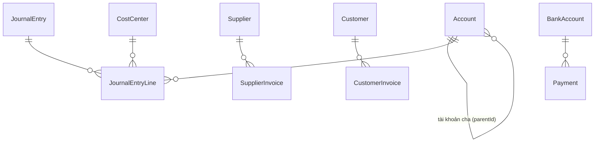

- **Account** (Chart of Accounts): `companyId`, `code`, `name`, `type` (`ASSET`/`LIABILITY`/`EQUITY`/`REVENUE`/`EXPENSE`), `parentId`
- **JournalEntry**: `companyId`, `code`, `date`, `refType`, `refId`, `description`, `status` (`DRAFT`/`POSTED`/`LOCKED`) — bất biến: không sửa khi `LOCKED`
- **JournalEntryLine**: `journalEntryId`, `accountId`, `debit Int`, `credit Int`, `currency`, `exchangeRate`, `costCenterId` (nullable), `partnerType` (nullable), `partnerId` (nullable) — bất biến: `SUM(debit) = SUM(credit)` trong 1 `JournalEntry`
- **CostCenter**: `companyId`, `code`, `name`
- **SupplierInvoice** (AP): `companyId`, `code`, `supplierId`, `poId` (nullable), `currency`, `exchangeRate`, `amount Int`, `paidAmount Int`, `dueDate`, `status` (`PENDING`/`PARTIALLY_PAID`/`PAID`/`OVERDUE`)
- **CustomerInvoice** (AR): `companyId`, `code`, `customerId`, `soId` (nullable), `currency`, `amount Int`, `paidAmount Int`, `dueDate`, `status` (`PENDING`/`PARTIALLY_PAID`/`PAID`/`OVERDUE`)
- **Payment**: `companyId`, `code`, `direction` (`IN`/`OUT`), `partnerType` (`SUPPLIER`/`CUSTOMER`), `partnerId`, `amount Int`, `currency`, `exchangeRate`, `method`, `bankAccountId` (nullable), `paidAt`, `refType`, `refId`
- **BankAccount**: `companyId`, `bankName`, `accountNo`, `currency`
- **FixedAsset**: `companyId`, `code`, `name`, `purchaseDate`, `originalCost Int`, `usefulLifeMonths`, `currentValue Int`
- **Budget**: `companyId`, `departmentId` (nullable), `costCenterId` (nullable), `period`, `category`, `plannedAmount Int`, `currency`

---

## 14. HRM & Payroll

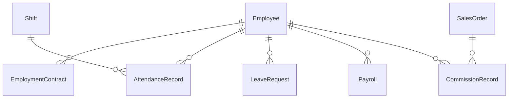

- **EmploymentContract**: `employeeId`, `type`, `startDate`, `endDate`, `baseSalary Int`, `currency`
- **Shift**: `companyId`, `name`, `startTime`, `endTime`
- **AttendanceRecord**: `employeeId`, `shiftId`, `date`, `checkIn`, `checkOut`, `otHours Float`
- **LeaveRequest**: `employeeId`, `type` (`ANNUAL`/`SICK`/`UNPAID`/`SPECIAL`), `fromDate`, `toDate`, `status` (`PENDING`/`APPROVED`/`REJECTED`)
- **Payroll**: `companyId`, `employeeId`, `period`, `baseSalary Int`, `allowance Int`, `bonus Int`, `commission Int`, `otAmount Int`, `insuranceDeduction Int`, `taxDeduction Int`, `netAmount Int`, `currency`, `status` (`DRAFT`/`CONFIRMED`/`PAID`)
- **CommissionRecord**: `employeeId`, `soId` (nullable, FK → SalesOrder), `amount Int`, `currency`, `period`

---

## 15. Workflow / Approval (cross-cutting, đa hình)

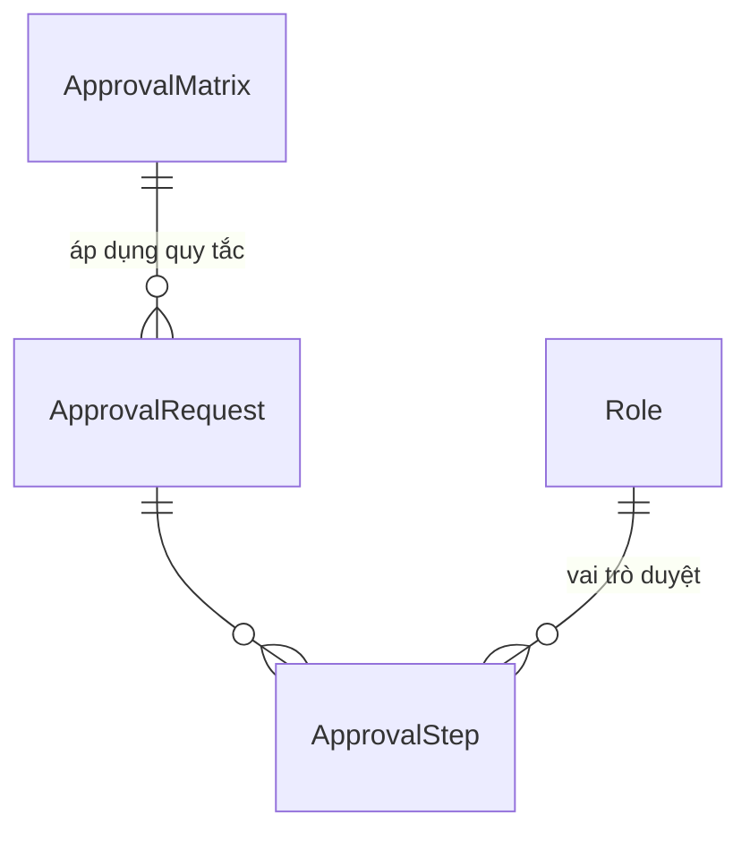

- **ApprovalMatrix**: `companyId`, `transactionType` (vd. `"PurchaseOrder"`, `"SalesDiscount"`), `minAmount Int`, `maxAmount Int`, `approverRoleId`
- **ApprovalRequest**: `companyId`, `entityType` (vd. `"PurchaseOrder"`), `entityId`, `requestedById`, `status` (`PENDING`/`APPROVED`/`REJECTED`), `currentStep Int`
- **ApprovalStep**: `approvalRequestId`, `stepOrder`, `approverRoleId` (nullable), `approverUserId` (nullable), `status` (`PENDING`/`APPROVED`/`REJECTED`/`SKIPPED`), `actedAt`, `comment`
- **AuditLog**: `companyId`, `entityType`, `entityId`, `action` (`CREATE`/`UPDATE`/`DELETE`/`APPROVE`/`REJECT`), `changedById`, `oldValue` (JSON string), `newValue` (JSON string), `createdAt`
- **Notification**: `companyId`, `userId`, `type`, `title`, `message`, `isRead Boolean`, `createdAt`

> Phase 0 chỉ mô tả entity. Approval Matrix chi tiết theo % chiết khấu/giá trị giao dịch, escalation, đa kênh thông báo (Email/SMS/Zalo/Teams) → làm đầy đủ ở Phase 10 theo `docs/business-spec/12-workflow-approval.md`. Phase 1 chỉ cần "request → 1 người duyệt" tối giản (theo ROADMAP).

---

## 16. Ghi chú thiết kế quan trọng

1. **SerialNumber vs LotBatch vs InventoryBalance**: `Product.manageSerial`/`manageLot` quyết định luồng nào áp dụng cho SKU đó. `InventoryBalance` là số tổng hợp theo (`warehouseId`,`productId`,`lotId`) — hàng có serial vẫn cộng dồn vào `InventoryBalance` nhưng đơn vị theo dõi chi tiết là `SerialNumber.status`.
2. **StockMovement là sổ cái duy nhất** ghi nhận mọi biến động tồn kho (nhập/xuất/điều chuyển/ký gửi/bảo hành/kiểm kê điều chỉnh). `InventoryBalance` có thể coi là bảng cache được cập nhật từ `StockMovement` — tránh 2 nguồn sự thật.
3. **Đại lý = Customer + DealerProfile**, không tách bảng `Dealer` riêng, vì nghiệp vụ (04, 14) mô tả đại lý vẫn là một loại khách hàng (mua/nợ/giao hàng) nhưng có thêm thuộc tính ký gửi/tier — tách 1-1 để không làm phình bảng `Customer` với field chỉ dealer mới dùng.
4. **Consignment (ký gửi) tách khỏi Inventory thường**: hàng ký gửi vẫn thuộc sở hữu công ty (theo 01/14) nên `ConsignmentBalance` độc lập với `InventoryBalance` của kho đại lý ảo — khi `ConsignmentSalesReport` xác nhận bán mới phát sinh doanh thu/công nợ/hoa hồng (side-effect chain ghi trong business-spec 14 mục cuối).
5. **Approval/Audit dùng entityType+entityId (không FK cứng)**: vì hầu như mọi bảng giao dịch (PO, SalesOrder, StockAdjustment, WarrantyClaim, Payment, LeaveRequest...) đều cần approval — FK cứng tới từng bảng sẽ tạo hàng chục cột nullable trên `ApprovalRequest`. Đánh đổi: mất kiểm tra tham chiếu ở tầng DB, phải kiểm tra ở tầng ứng dụng.
6. **Company hiện tại chỉ có 1 bản ghi mặc định** (seed sẵn) nhưng field `companyId` có mặt trên mọi bảng chính để sẵn sàng multi-company sau này — không được bỏ qua dù chưa dùng tới.

---

## 17. Chưa chốt / để lại phase sau (không thuộc phạm vi Phase 0 ERD)

- Chi tiết cơ chế tính giá vốn (FIFO/Moving Average/Standard) — chốt kỹ thuật ở Phase 3, hiện ERD chỉ có `InventoryBalance`/`StockMovement` làm nền.
- Chi tiết bút toán tự động theo từng nghiệp vụ (vd. Goods Receipt → Dr 156/Cr 331) — Phase 8.
- Approval Matrix đầy đủ theo ngưỡng giá trị + escalation — Phase 10.
- Cấu trúc bảng phục vụ BI/Dashboard (data warehouse/materialized view) — Phase 11, không cần bảng OLTP riêng ở Phase 0.
- `docs/currency-handling.md`, `docs/nfr.md`, `docs/api-contract.md`, `docs/design-system.md` — xem mục "còn thiếu" trong `docs/TASKS.md`.
